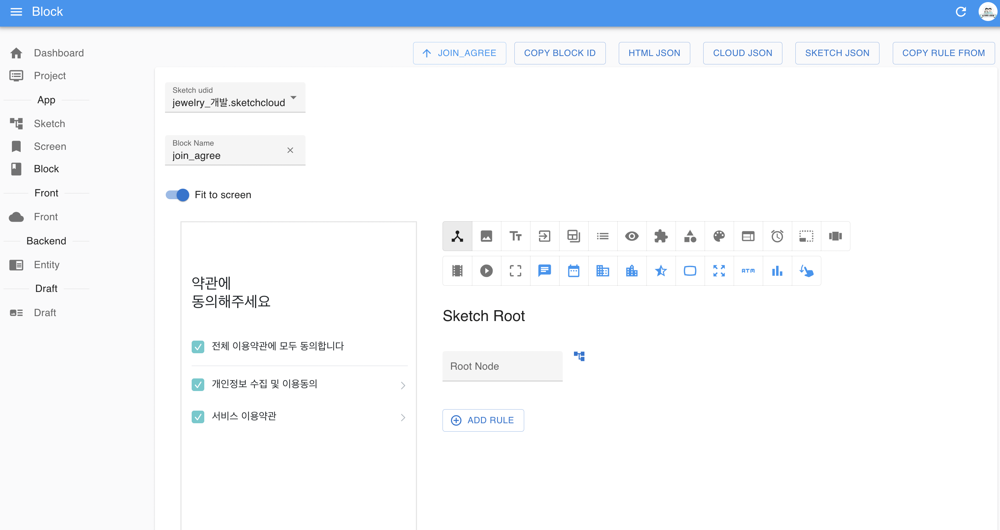
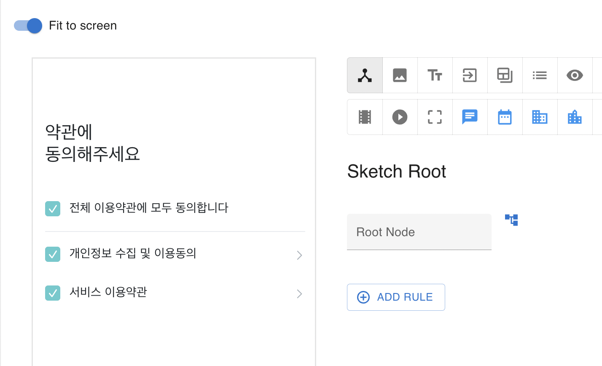
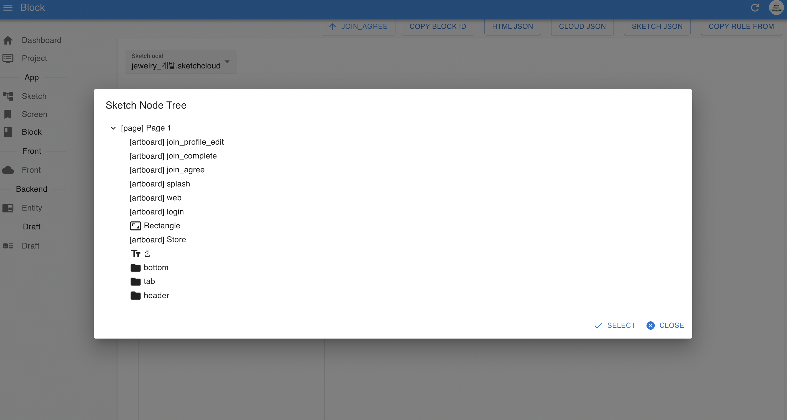

# What is block?

Block은 특정 Sketch Node를 Android Natvie 뷰로 만들기 위한 설정이다. 다음 화면과 같이 sketch의 특정 Node를 Block을 지정하면 다음과 같이 화면이 웹상에 보이며, 다양한 Block Rule을 설정할 수 있다



그리고 다음과 같은 Block Rule을 통해 클릭했을때, 동적 이미지, 동적 텍스트, 리스트 등으로 앱을 다이나믹하게 구현 할 수 있다

# data 참조
모든 block룰은 Screen의 data라는 변수를 기본적으로 참조한다

```javascript
data.my_name = 'Mondayless'
```
위와 같은 코드가 Screen에 있고 블럭룰중 하나인 Text Mappging에 특정 노드에 my_name을 걸어두면 
앱 화면의 그 텍스트가 'Mondayless'가 된다


# Block If Condition 

# Block Rule

## Sketch Root

Sketch의 특정 노드를 블록으로 등록한다
모든 Block은 이 단계를 먼저 해야한다





## Click Mapping


#### Hidden
Block Contition 에 따라 