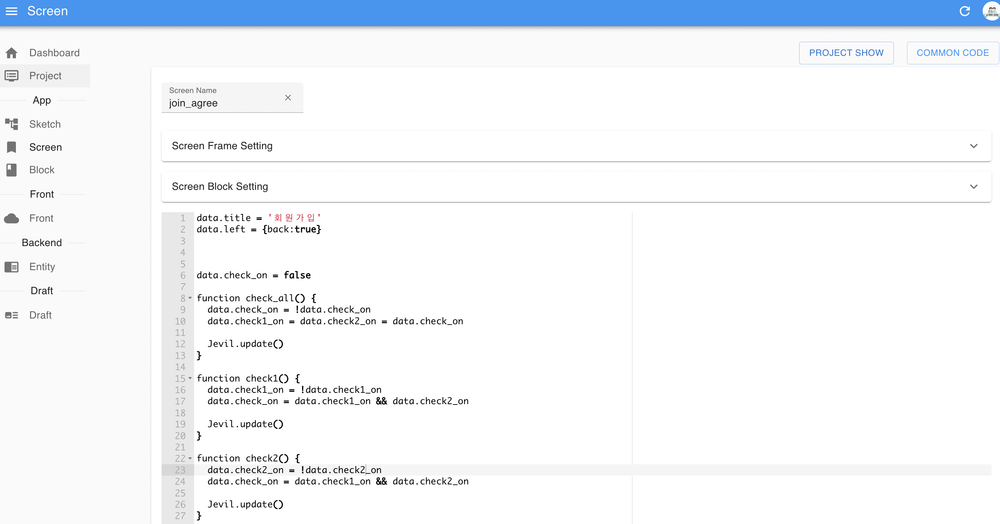
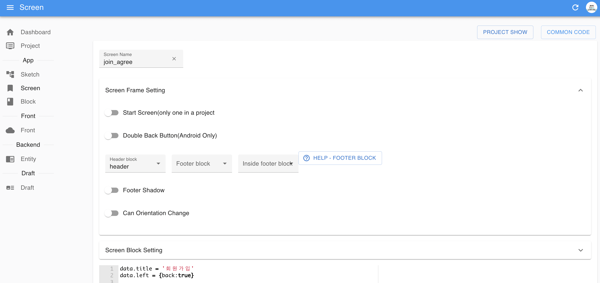
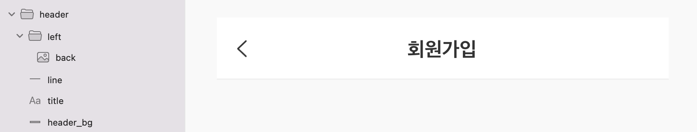

# Screen

Screen은 네이티브앱의 하나의 화면과 1:1 대응한다
DAB 콘솔에서 Screen을 생성한 후, 하나의 블록을 매핑한다

Screen에는 Javscript 영역이 있다 



Javascript 영역은 Screen에 진입했을 때 실행 되며, 에서 Jevil함수를 이용하거나, 클릭했을 때 처리 함수를 정의(Block 에서 호출) 등의 코드 들이 들어간다

## Screen 설정



- Start Screen

    앱의 처음 시작을 이 Screen으로 설정한다. Start Screen이 on으로 설정되면 다른 Screen은 자동으로 off 된다

- 공통 Header 블록
    
    어떤 블록을 Header 블록으로 설정할 수 있다

- 공통 Footer 블록
    어떤 블록을 Header 블록으로 설정할 수 있다

- 백키 더블 클릭으로 종료(안드로이드 Only)
    안드로이드의 경우 백키를 두번눌러서 액티비티를 종료하게 만든다

## Header Block


Header 블록을 지정하면 스크린 상단에 해드 블럭이 붙는다.
해더 블럭은 iOS의 경우 iOS NavigationBar의 형태를 취하고, Android는 단순 View의 형태를 취한다

Header 블록에는 고정된 노드 명을 써야하며 있고 다음과 같이 설정된다

 - left : 좌측 아이콘 모음
 - right : 우측 아이콘 모음
 - title : 해더 타이틀
 - logo : 타이틀 자리에 텍스트 대신 이미지가 들어갈 경우
 - line : 해더 하단의 line이며 컬러가 적용된다
 - header_bg : 해더의 배경색이다

```javascript
//타이틀이 '회원가입'이 된다
data.title = '회원가입' 

// 백버튼이 보인다 백버튼에 대한 클릭은 Block Rule(Click)로 지정한다. 또한 다른 아이콘도 스캐치의 back버튼에 겹쳐서 left노드의 하단에 넣으면 좌측 아이콘이 된다
data.left = {back:true} 

//마찬가지로 우측 아이콘을 설정한다
data.right = {complete_icon:true} 

//이렇게 전화면에서 해더의 타이틀을 줄 수 도 있다
Jevil.go('web', {title:'개인정보 처리방침'}) 
```



[해더 샘플 스캐치 다운로드](screen_header_sample.zip)

## Footer Block
 - TODO

#### Footer Inside Block